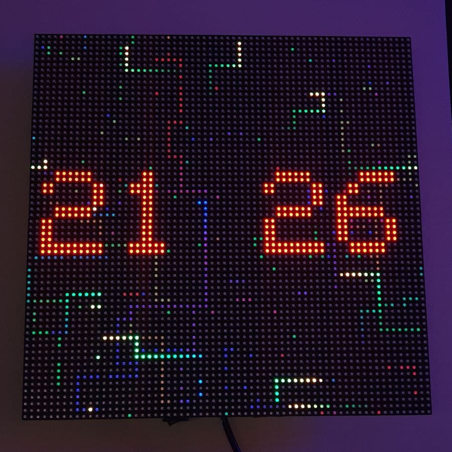
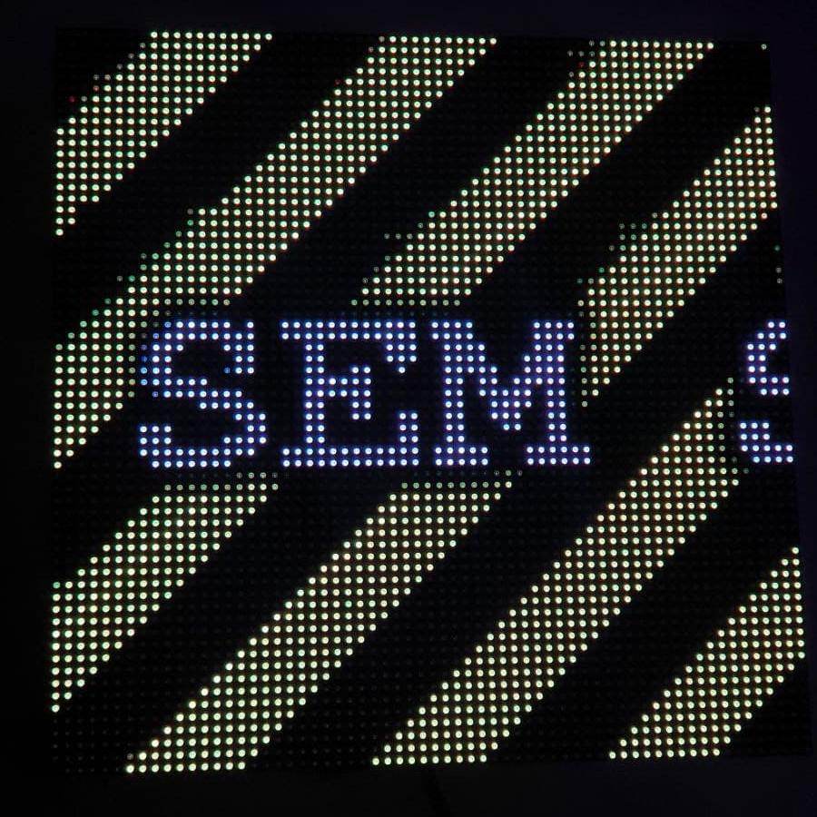

# ESP32 HUB Panel
A ESP32 clock / display using 64x32 HUB75 panels.


This is a very hacky code that will display a clock in two 64x32 HUB75 LED Matrix Panels arranged in a 64x64 matrix. It can also receive images through UDP.

If an image has not been sent to the panel in the last 5 seconds, it automatically switches back to clock mode.

The panel used in this project is this one [https://s.click.aliexpress.com/e/_AAr36k](https://s.click.aliexpress.com/e/_AAr36k) - But chinese led panel manufactures like to change the specifications of the panel, so if you are from the future, the panel might have changed and might need some tweaks.

# Required Libraries

* https://github.com/adafruit/Adafruit-GFX-Library
* https://github.com/mrfaptastic/ESP32-HUB75-MatrixPanel-I2S-DMA
* https://github.com/FastLED/FastLED

# Wiring

The LED panels are in daisy-chain mode (the output of the first one hooked up the input of the second one). And the first panel is connected to ESP32 by default through these pins:

|HUB75|ESP32 Pin|
|-|-|
|R1  | 14 |
|G1  | 15 |
|BL1 | 16 |
|R2  | 17 |
|G2  | 18 |
|BL2 | 19 |
|A   | 21 |
|B   | 22 |
|C   | 23 |
|D   | 25 |
|CLK |  2 |
|LAT | 27 |
|OE  |  5 |


The pins can be changed in `ledcontroller.h` file.

# Clock Mode



# Image Mode

Use sendimage golang script:

```bash
cd sendimage
go build -o send
./send image.jpg HOSTNAME.local
```




# Packet Format

The ESP32 listens on UDP port 1234 and expects the UDP Packet to contain one or more PanelPacket structs inside it. You can send as many PanelPacket structs inside a UDP packet and the ESP32 will process them sequentially. The only limitation is that the UDP packet cannot exceed the network MTU since it does not support packet fragmentation.

```c
struct PanelPacket {
  uint16_t lineN; // Number of the line
  uint16_t pixels[64]; // Line Content
};
```
